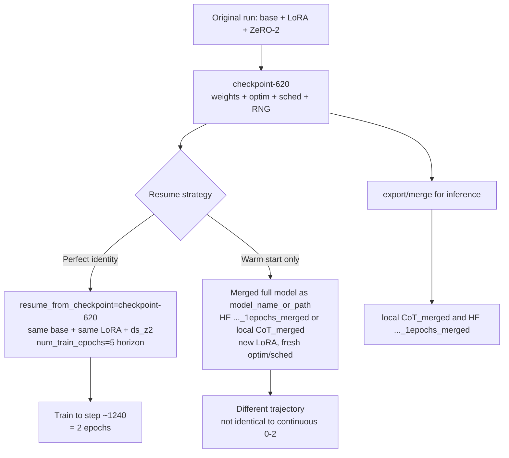
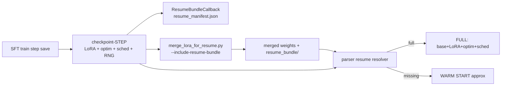

# Plan: Perfectly Resume CoT LoRA SFT from Epoch 1 → Epoch 2

## Goal

1. Continue the existing CoT SFT run so that the model after **2 epochs** is the same as if training had run continuously from epoch 0 → 2 under the original hyperparameters — including learning-rate schedule, optimizer state, epoch/step counters, RNG, and data-skip position.
2. **Harden the training stack** so that each epoch/step checkpoint (and, optionally, each merged export) systematically preserves everything needed for that continuous resume — Adam/DeepSpeed optim state, LoRA adapter weights, scheduler, RNG, trainer counters — and resume code **uses those artifacts when present**, or **gracefully falls back** to warm-start approximation when they are missing.

## What the first run actually produced

| Item | Value |
|------|--------|
| Config | `examples/train_lora/trillium_qwen2_5vl_lora_sft_CoT_traineval.yaml` |
| Base model | `Qwen/Qwen2.5-VL-7B-Instruct` |
| Method | LoRA rank 8, **DeepSpeed ZeRO-2** (`examples/deepspeed/ds_z2_config.json`), 4×H100 |
| Planned horizon | `num_train_epochs: 5.0` → **3085** optimizer steps |
| Warmup | `warmup_ratio: 0.1` → **308** steps |
| Saved checkpoint | `saves/qwen2_5vl-7b/lora/sft/CoT_traineval/checkpoint-620` |
| Trainer state | `global_step=620`, `epoch≈1.005`, `max_steps=3085` |
| LR at step 620 | `≈9.695e-5` (cosine after warmup on the **5-epoch** horizon) |
| Full training state present | `adapter_model.safetensors`, `scheduler.pt`, `trainer_state.json`, `rng_state_{0..3}.pth`, DeepSpeed `global_step620/*optim_states*` (4 rank shards) |
| Merged full model (local) | `models/qwen2_5vl_lora_sft_CoT_merged/` (31G on disk including 7-shard layout, via `scripts/merge_lora_for_resume.py`) |
| Merged full model (HF hub cache) | `.../models--cvis-tmu--qwen2_5vl-7b-lora-sft-CoT_traineval_1epochs_merged/snapshots/ff9aee7e41009473d2f7fb1b9c75e7ce23bd1214/` — **complete** (~16.5GB weights, 10 shards) |
| Non-merged HF path (do not use) | `models--cvis-tmu--qwen2_5vl-7b-lora-sft-CoT_traineval_1epochs` — incomplete (~54MB, adapter/tokenizer only) |

### ZeRO-2 and resume safety

The original run (and therefore `checkpoint-620`) used **ZeRO-2**, not ZeRO-3. That is important:

- This repo has repeatedly hit **DeepSpeed ZeRO-3 + LoRA resume tracing errors** (see comments in SQA3D resume YAMLs: *“Switched to ZeRO-2 to avoid ZeRO-3 LoRA checkpoint resumption bug (tracing error)”*).
- LLaMA-Factory’s adapter auto-resume path also **skips** full auto-resume under ZeRO-3 unless `resume_from_checkpoint` is set explicitly (`parser._try_auto_resume_from_adapter`).
- Resuming this CoT job should keep **`deepspeed: examples/deepspeed/ds_z2_config.json`** (same stage, same world size = 4). Do **not** switch to `ds_z3_*.json` for the resume job.
- ZeRO-2 still loads optimizer shards from `checkpoint-620/global_step620/bf16_zero_pp_rank_{0..3}_mp_rank_00_optim_states.pt` and scheduler from `scheduler.pt` — this is the supported full-resume path for identity.

### Downloaded merged model (inspected)

Path:

`/scratch/indrisch/huggingface/hub/models--cvis-tmu--qwen2_5vl-7b-lora-sft-CoT_traineval_1epochs_merged/snapshots/ff9aee7e41009473d2f7fb1b9c75e7ce23bd1214/`

Verified contents:

| Check | Result |
|-------|--------|
| Architecture | `Qwen2_5_VLForConditionalGeneration` / `model_type: qwen2_5_vl` |
| Weight index | `model.safetensors.index.json` → **10 shards**, 729 tensors, `total_size ≈ 1.658e10` |
| Shard files present | All `model-0000{1..10}-of-00010.safetensors` exist; sum of sizes matches index (~16.58 GB) |
| Extra files in snapshot | Also has unused `model-0000*-of-00007.safetensors` (7-shard set **not** referenced by the index — leftover from another **merged** export layout; loaders use the index, so ignore these) |
| Tokenizer / processor | Present (`tokenizer.json`, `preprocessor_config.json`, `video_preprocessor_config.json`, …) |
| `merge_manifest.json` | Same as local: mode `merged_warm_start`, adapter was `checkpoint-620`, notes that optim/scheduler are **not** preserved |
| Training artifacts | **None** — no `trainer_state.json`, `scheduler.pt`, `optimizer.pt`, or LoRA `adapter_*` |

### Clarification: what we train from (10-shard merge vs base+adapter)

**Path A (perfect continuous resume — what this plan recommends for epoch 1→2) does *not* start from the merged model at all.**

| Role | Path | What it is |
|------|------|------------|
| **Train base** | `Qwen/Qwen2.5-VL-7B-Instruct` (HF hub / local snapshot under `models--Qwen--Qwen2.5-VL-7B-Instruct/`) | Original dense instruction model (its own hub sharding; unrelated to the merge’s 7- vs 10-shard files) |
| **Train adapter + optim/sched** | `saves/.../CoT_traineval/checkpoint-620/` | LoRA weights + DeepSpeed Adam shards + `scheduler.pt` + `trainer_state.json` + RNG |
| **Merged 10-shard (HF)** | `.../qwen2_5vl-7b-lora-sft-CoT_traineval_1epochs_merged/.../model-*-of-00010.safetensors` | **Inference / warm-start only** — base+LoRA already folded; no Adam/LoRA training state |
| **Merged 7-shard leftovers** | Same HF dir’s `model-*-of-00007.safetensors`, or local `models/qwen2_5vl_lora_sft_CoT_merged/` (7× ~5 GB shards) | Alternate packaging of the **same kind of merged dense model**, not “base + separate adapter.” Still no training state. |

So:

- **Perfect identity (0→2 continuous):** `model_name_or_path` = **base Qwen**, `adapter_name_or_path` + `resume_from_checkpoint` = **`checkpoint-620`**. Ignore both 7-shard and 10-shard merged trees for training.
- **Warm-start only (not continuous):** `model_name_or_path` = **merged** snapshot; prefer the **10-shard** set because that is what `model.safetensors.index.json` points at. The 7-shard files in that HF folder are unused duplicates of a different shard layout, not a second training path.

The 7- vs 10-shard distinction is only about **how the merged dense weights were sharded for storage**, not about whether you have a separate adapter.

So the HF merged snapshot is a valid **full dense checkpoint for inference / warm-start**, but still has **zero** optimizer/scheduler/RNG continuity.

## Critical design fact (why “merged model resume” cannot be perfect)

Exact identity of continuous training requires **all** of:

1. LoRA adapter weights (or equivalent parameterization)
2. Adam optimizer moments (DeepSpeed ZeRO-2 shards)
3. LR scheduler internal step (`scheduler.pt` / `last_epoch`)
4. Trainer counters (`global_step`, epoch)
5. Per-rank RNG (`rng_state_*.pth`)
6. Same data skip position inside the epoch
7. Same world size, batch size, GA, DS config, seed, dataset mix

**Merging LoRA into the base only preserves (1) folded into dense weights.**  
Your own merge manifest already states this:

- `models/qwen2_5vl_lora_sft_CoT_merged/merge_manifest.json` → mode `merged_warm_start`
- Notes: optimizer/scheduler continuity is **not** preserved

Starting a **new** LoRA on the merged base:

- Re-initializes A/B matrices (different parameterization than continuing the same adapter)
- Resets Adam moments to zero
- Rebuilds cosine from step 0 (unless heavily customized)
- Cannot match continuous 0→2 weights

**Conclusion (today’s artifacts):** For identity with the *current* epoch-1 outputs, training must resume from **`checkpoint-620`** under **ZeRO-2**. The existing merged full model (local or HF `..._1epochs_merged`) is weights-only and can only warm-start.

**Conclusion (what we will build):** Checkpoints and optional merge packages must carry a **resume bundle** so that “export for inference” no longer silently throws away Adam/LoRA continuity. Resume logic will prefer the bundle when complete, and approximate when incomplete.

### What is already saved vs what is lost

With `save_only_model: false` (already set on the CoT YAML), HuggingFace/DeepSpeed **already write** into each `checkpoint-{step}/`:

| Artifact | Role | Present in `checkpoint-620`? | Present in merged HF model? |
|----------|------|------------------------------|-----------------------------|
| `adapter_model.safetensors` + `adapter_config.json` | LoRA continuity | Yes | **No** (folded into dense weights) |
| `global_step620/*optim_states*.pt` | Adam moments (ZeRO-2) | Yes | **No** |
| `scheduler.pt` | LR schedule step | Yes | **No** |
| `trainer_state.json` | global_step, epoch, log history | Yes | **No** |
| `rng_state_{0..3}.pth` | per-rank RNG | Yes | **No** |
| `training_args.bin` | saved train args | Yes | **No** |
| Dense `model-*.safetensors` | merged full weights | No (LoRA-only ckpt) | Yes |

So the gap is **not** “Trainer never saves Adam.” The gap is:

1. **No validation/manifest** that a checkpoint is resume-complete (easy to ship a broken folder).
2. **Merge/export drops** all training state (and LoRA A/B once folded).
3. **Resume detection is incomplete**: full resume works from a LoRA checkpoint dir; there is no first-class “resume bundle next to a merged model,” and missing pieces only partially degrade (or fail) instead of a deliberate warm-start path.

You **cannot** recover original LoRA A/B (or Adam moments over A/B) from dense merged weights alone. “LoRA continuity” after merge requires **keeping the unmerged adapter (+ optim) as a sidecar**, not reconstructing it from the merge.



## LR-schedule pitfall (must get this right)

Original cosine was built with **`num_training_steps = 3085`** (5 epochs).

HuggingFace Trainer (v4.57.1 in your venv):

1. Creates a **new** scheduler from **current** `max_steps` / `num_train_epochs`
2. Loads `scheduler.pt` (only restores `last_epoch` / step counter — **not** the original total length)
3. Then `init_training_references()` **overwrites** `state.max_steps` from current args

So:

| Resume YAML choice | Result |
|--------------------|--------|
| Keep `num_train_epochs: 5.0`, no `max_steps` | Scheduler horizon stays **3085**; LR continues correctly from step 620 |
| Set `num_train_epochs: 2` or `max_steps: 1240` | New horizon ≈1234–1240; LR formula changes; step-620 LR would be ~5.8e-5 instead of ~9.7e-5 — **breaks identity** |
| Set `num_train_epochs: 1` + full resume (old SQA3D pattern) | Often trains **zero steps** because `global_step=620 ≥ new max_steps` |

Also: prior repo “epoch2 / continued” YAMLs that set `num_train_epochs: 1.0` while pointing at a full checkpoint are **not** a correct continuous-schedule resume pattern. Do not copy that pattern here.

### Stopping after exactly 2 epochs without breaking LR

Desired stop step ≈ **1240** (`2 × 617` update steps/epoch; next save with `save_steps: 620`).

Because `max_steps` is both the training stop condition **and** the scheduler length, stock YAML cannot set `max_steps: 1240` while keeping a 3085-step cosine.

**Recommended pure-config approach (simplest, correct LR):**

- Resume with **`num_train_epochs: 5.0`** (identical horizon)
- Keep `save_steps: 620` / `eval_steps: 620`
- Let the job run; **`checkpoint-1240` is the 2-epoch artifact**
- Optionally cancel the job after that checkpoint is written (saves compute for epochs 3–5)

**Optional code approach (if you refuse extra epochs of wall-clock):**

- Add a tiny `TrainerCallback` that sets `control.should_training_stop = True` at `global_step >= 1240`
- Keep `num_train_epochs: 5.0` so the scheduler is still built for 3085 steps
- This is the clean way to “train only one more epoch” with perfect schedule continuity

## Code changes: complete resume artifacts on save + optional use on resume

This is the structural fix so future epoch-N saves (and optional merges) support continuous training without relying on tribal knowledge.

### C1. Define a `resume_bundle` contract

Introduce a documented, versioned layout (either the checkpoint dir itself, or `merged_dir/resume_bundle/`):

```text
resume_bundle/   # or checkpoint-{step}/ which already is one
  resume_manifest.json          # NEW: machine-readable inventory + metadata
  adapter_config.json           # LoRA continuity
  adapter_model.safetensors
  trainer_state.json
  scheduler.pt
  training_args.bin
  rng_state_0.pth … rng_state_{W-1}.pth
  global_step{S}/               # DeepSpeed ZeRO-2 optim shards
    bf16_zero_pp_rank_*_mp_rank_00_optim_states.pt
    mp_rank_00_model_states.pt
  latest                        # DeepSpeed tag
```

`resume_manifest.json` fields (minimum):

- `schema_version`, `created_utc`
- `global_step`, `epoch`, `max_steps`, `num_train_epochs`
- `world_size`, `deepspeed_stage` (must be 2 for this project’s LoRA resume)
- `finetuning_type`, `lora_rank` (if LoRA)
- `base_model_name_or_path` (for re-attaching LoRA)
- `learning_rate`, `lr_scheduler_type`, `warmup_ratio`
- `artifacts`: map of required keys → `{present: bool, path: ...}`
- `resume_mode_if_incomplete`: `"warm_start"` | `"error"`
- `notes`: human-readable

### C2. Trainer callback: validate + write manifest on every save

Add e.g. `ResumeBundleCallback` in `src/llamafactory/train/callbacks.py`, hooked from SFT trainer setup (same place as other callbacks):

**`on_save` / `on_train_end` (rank 0, after HF/DeepSpeed finish writing the checkpoint):**

1. Resolve `output_dir/checkpoint-{global_step}` (and final `output_dir` on train end if applicable).
2. Inventory required artifacts (table above). For DeepSpeed, detect `global_step*` dir and count optim rank files vs `world_size`.
3. Write/update `resume_manifest.json` in that directory.
4. Log a clear one-liner:
   - `Resume bundle COMPLETE at checkpoint-620 (full continuity available)` or
   - `Resume bundle INCOMPLETE: missing X,Y — only warm-start resume will be possible`
5. Optional hard mode via new flag `require_resume_bundle: true` (finetuning or training arg): raise if incomplete when `save_only_model` is false.

**Also enforce / document:**

- Prefer `save_only_model: false` for any run that may be resumed (CoT already does).
- If `save_only_model: true`, manifest should mark `resume_capable: false` explicitly.

No need to re-implement Adam saving if DeepSpeed already writes optim shards — **validate and advertise** them. If a future path uses non-DS optimizers, also check for `optimizer.pt`.

### C3. Merge/export: optional attach of resume bundle (LoRA continuity sidecar)

Extend `scripts/merge_lora_for_resume.py` (and/or `llamafactory-cli export` wrapper):

New flags:

- `--include-resume-bundle` (default **true** for this project’s merge wrapper, or explicit opt-in)
- `--resume-bundle-source` (default: the `--adapter-checkpoint` dir)
- `--resume-bundle-subdir` (default: `resume_bundle`)

Behavior when enabled:

1. Perform merge as today (dense weights for inference).
2. Copy/link resume artifacts from the LoRA checkpoint into `output_dir/resume_bundle/`.
3. Write `resume_manifest.json` with:
   - `merged_weights: true`
   - `base_model_for_lora_resume: <original base, not the merged path>`
   - pointer that **perfect train resume must use adapter + base**, while merged weights are for eval
4. Update top-level `merge_manifest.json` notes: no longer claim “optimizer never preserved” when bundle is attached.

Important design rule:

- Perfect train resume still uses **base model + LoRA adapter + optim from `resume_bundle`**, not “load merged dense + reload optim over a new LoRA.”
- The merged weights and the resume bundle are **siblings** in one package so HF upload / archival keeps both.
- If user later sets `model_name_or_path` to the merged dir **and** full bundle is present, resume code should **prefer** `resume_bundle` + original base (from manifest) rather than pretending optim maps onto a fresh LoRA on merged dense weights.

### C4. Resume-time logic: use bundle if complete, else approximate

Extend `src/llamafactory/hparams/parser.py` (and possibly model load) with a small resolver, e.g. `_resolve_resume_bundle(...)`:

**Search order for a resume source:**

1. Explicit `resume_from_checkpoint`
2. Explicit `adapter_name_or_path[-1]` if it looks like a checkpoint/bundle
3. `{model_name_or_path}/resume_bundle` if that directory exists (merged package case)
4. Last checkpoint under `output_dir` (existing behavior)

**Classification:**

| Class | Criteria | Behavior |
|-------|----------|----------|
| `full` | adapter (+ config) + `trainer_state.json` + `scheduler.pt` + optim shards matching world size + RNG optional | Set `resume_from_checkpoint` + `adapter_name_or_path`; keep original base from manifest if needed; log FULL RESUME |
| `partial` | adapter + trainer_state but missing optim and/or scheduler | Load adapter weights; **do not** claim full resume; optionally advance scheduler if `scheduler.pt` exists; warn PARTIAL |
| `weights_only` | dense model or adapter weights without trainer/optim | Warm-start: new optim/sched from epoch 0 of *this* job; warn WARM START |

New YAML knobs (suggested):

```yaml
# Prefer full continuity when artifacts exist
resume_from_checkpoint: null   # or explicit path / "auto"
# When resume artifacts incomplete:
allow_warm_start_resume: true  # if false, error out instead of approximating
# Optional: force reading bundle next to a merged model
resume_bundle_dir: null        # default: <model_name_or_path>/resume_bundle if present
```

Implementation detail: extend `_get_missing_adapter_resume_artifacts` to also check optim/scheduler/RNG and return a structured report (not only adapter + trainer_state). Today auto-resume can enable `resume_from_checkpoint` with only adapter+trainer_state; DeepSpeed may then fail or reset optim if shards missing — make that explicit.

### C5. Optional: save final “epoch package” helper

Small utility `scripts/package_epoch_for_resume.py`:

- Inputs: `checkpoint-N`, base model id, optional merge
- Outputs: directory with dense merge (optional) + `resume_bundle/` + README
- Used by post-epoch SLURM steps / HF upload

### C6. Tests / smoke checks

- Unit test: given a fake checkpoint tree, manifest writer marks complete vs incomplete correctly.
- Unit test: resolver returns `full` / `partial` / `weights_only`.
- Smoke: dry-run parser with `adapter_name_or_path=checkpoint-620` → full resume; with HF merged path alone → warm start; with merged path + synthetic `resume_bundle` → full resume wiring.
- Do **not** require a multi-GPU training run for CI; optional cluster smoke later.

### C7. Scope boundary

- Do **not** attempt to invent Adam state from merged weights.
- Do **not** switch to ZeRO-3.
- Keep changes local to callbacks, parser resume resolution, merge script, and new YAML examples — avoid broad Trainer forks unless necessary.



---

## Recommended training solution for this CoT epoch-2 job (Path A)

Even after code lands, **this** run should still resume from existing **`checkpoint-620`** (already a complete bundle under the contract above). The code work makes the contract explicit, merge-safe, and self-documenting for epochs 2→N.

### A1. New YAML

Create:

`examples/train_lora/trillium_qwen2_5vl_lora_sft_CoT_traineval_resume_epoch2.yaml`

Clone of `trillium_qwen2_5vl_lora_sft_CoT_traineval.yaml` with these deltas:

```yaml
### model
model_name_or_path: Qwen/Qwen2.5-VL-7B-Instruct   # NOT the merged model
# keep cache_dir, image/video pixels, trust_remote_code identical

### method
# identical LoRA: rank 8, target all, stage sft

### dataset
# identical: Scene30k,SpatialSSRL_coldstart,3DThinker10k, concat, cutoff, workers, etc.

### output
output_dir: saves/qwen2_5vl-7b/lora/sft/CoT_traineval_resume_ep2
overwrite_output_dir: true
save_steps: 620
eval_steps: 620
save_only_model: false          # REQUIRED — need optim/sched for future resumes
report_to: wandb

### train
# ALL of these must match the original run:
per_device_train_batch_size: 2
gradient_accumulation_steps: 8
learning_rate: 1.0e-4
num_train_epochs: 5.0           # CRITICAL: keep original cosine horizon
# do NOT set max_steps
lr_scheduler_type: cosine
warmup_ratio: 0.1
bf16: true
deepspeed: examples/deepspeed/ds_z2_config.json   # MUST stay ZeRO-2 (matches checkpoint; avoids ZeRO-3 LoRA resume tracing bugs)

# Explicit full resume (prefer explicit over auto):
resume_from_checkpoint: /scratch/indrisch/LLaMA-Factory/saves/qwen2_5vl-7b/lora/sft/CoT_traineval/checkpoint-620
adapter_name_or_path: /scratch/indrisch/LLaMA-Factory/saves/qwen2_5vl-7b/lora/sft/CoT_traineval/checkpoint-620
```

**Starting point for Path A (explicit):** base Qwen **+** `checkpoint-620` adapter/optim — **not** the 10-shard (or 7-shard) merged model.

Notes:

- LLaMA-Factory auto-resume (`parser._try_auto_resume_from_adapter`) will also set `resume_from_checkpoint` from an adapter dir that contains `trainer_state.json` + adapter weights — but **explicit is safer**.
- Do **not** set `create_new_adapter: true` (that disables auto-resume and starts a new LoRA).
- **Keep ZeRO-2** (`ds_z2_config.json`). The original checkpoint was produced under ZeRO-2; switching to ZeRO-3 invites the known LoRA resume/tracing failures this repo already worked around on SQA3D.
- Keep **4 GPUs** (checkpoint has 4 optim shards + 4 RNG files). Changing world size requires `scripts/convert_deepspeed_checkpoint_world_size.py` first.
- Do **not** set `model_name_or_path` to either merged tree (`*-of-00010` HF package or local 7-shard `CoT_merged`) for Path A.

### A2. SLURM entrypoints

Mirror the existing CoT scripts so YAML discovery still works:

| New file | Based on | Change |
|----------|----------|--------|
| `models/qwen2_5vl_lora_sft_CoT/trillium_slurm_qwen2_5vl_lora_sft_CoT_traineval_resume_epoch2.sh` | existing trillium wrapper | calls new inner script / new experiment name |
| `models/qwen2_5vl_lora_sft_CoT/slurm_qwen2_5vl_lora_sft_CoT_traineval_resume_epoch2.sh` | existing slurm script | `EXPERIMENT_NAME=qwen2_5vl_lora_sft_CoT_traineval_resume_epoch2` so it loads `trillium_${EXPERIMENT_NAME}.yaml` |

Alternatively: one shared slurm script with `EXPERIMENT_NAME` / `YAML_FILE` env override — slightly cleaner, optional.

Resource requests: same as original (1 node, 4×H100, 96 CPUs, ~1 day). One additional epoch is ~same wall time as job 697713’s first epoch (~14h order of magnitude from the log).

### A3. Optional early-stop callback (if desired)

Small addition under `src/llamafactory/train/callbacks.py` (or a local callback file) + wire via YAML if supported, **or** a one-off train wrapper:

- Stop when `state.global_step >= 1240`
- Leave `num_train_epochs: 5.0` unchanged

Only implement if you do not want the job to continue toward epoch 5 after writing `checkpoint-1240`.

### A4. Launch procedure

```bash
cd /scratch/indrisch/LLaMA-Factory/models/qwen2_5vl_lora_sft_CoT
sbatch trillium_slurm_qwen2_5vl_lora_sft_CoT_traineval_resume_epoch2.sh
```

Preflight checks before submit:

1. `checkpoint-620` still has optim shards + `scheduler.pt` + `trainer_state.json` (`save_only_model` was false — good).
2. Same GPU count as original (4).
3. H5 env roots still valid (`SCANNET_H5_DIR`, `SPATIALSSRL_H5_DIR`, `THINKER10K_H5_DIR`).
4. New `output_dir` empty or `overwrite_output_dir: true` with **explicit** `resume_from_checkpoint` (do not rely on auto-resume-from-output-dir).

### A5. Verification that resume is “perfect”

On job start, logs must show roughly:

- `Continuing training from global step 620`
- `Continuing training from epoch 1`
- `Total optimization steps = 3,085` (not ~1234)
- First logged `learning_rate` near **`9.7e-5`**, **not** restarting near `0` / warmup
- Trainable params remain LoRA-scale (~tens of millions), not full 7B

After completion / at step 1240:

- Artifact: `.../CoT_traineval_resume_ep2/checkpoint-1240` (or final save if early-stopped)
- Compare loss/LR curves vs the first-run W&B offline run for steps 0–620 continuity into 620–1240
- Optional: merge `checkpoint-1240` for eval the same way as epoch-1 merge

### A6. Post-train merge / publish (with resume bundle)

After epoch-2 checkpoint exists, merge **with** the new flag so the package is resume-capable:

```bash
python scripts/merge_lora_for_resume.py \
  --base-model .../models--Qwen--Qwen2.5-VL-7B-Instruct/snapshots/... \
  --adapter-checkpoint .../CoT_traineval_resume_ep2/checkpoint-1240 \
  --output-dir models/qwen2_5vl_lora_sft_CoT_merged_2epochs \
  --include-resume-bundle
```

Expected layout:

```text
models/qwen2_5vl_lora_sft_CoT_merged_2epochs/
  model-*.safetensors          # inference
  resume_bundle/               # perfect train continuity
    resume_manifest.json
    adapter_* / trainer_state / scheduler / optim / rng ...
```

**Backfill for epoch-1 (optional):** run the same packaging against existing `checkpoint-620` into a new dir (or attach `resume_bundle/` under the local/HF merged trees) so future “resume from merged package” works. The currently downloaded HF `..._1epochs_merged` snapshot has **no** bundle today — warm-start only until backfilled.

---

## Path B — warm-start when resume artifacts are missing

Used automatically when resolver classifies `weights_only` / incomplete bundle and `allow_warm_start_resume: true`.

Valid weights-only bases today:

- Local: `/scratch/indrisch/LLaMA-Factory/models/qwen2_5vl_lora_sft_CoT_merged`
- HF: `.../models--cvis-tmu--qwen2_5vl-7b-lora-sft-CoT_traineval_1epochs_merged/snapshots/ff9aee7e41009473d2f7fb1b9c75e7ce23bd1214`

Behavior:

- New LoRA on top of dense (or load adapter weights without optim)
- Fresh Adam + cosine from this job’s `num_train_epochs` / `max_steps`
- Log a loud `WARM START` warning listing missing artifacts
- **Not** identical to continuous 0→2

HF snapshot note: load via `model.safetensors.index.json` (10-shard set); ignore leftover `*-of-00007.safetensors` files in the same directory.

---

## Files to add/change

### Code / tooling (resume continuity)

1. **Add** `src/llamafactory/train/resume_bundle.py` — inventory, manifest schema, completeness classification (`full` / `partial` / `weights_only`)
2. **Add** `ResumeBundleCallback` in `src/llamafactory/train/callbacks.py` — write manifest + log on each save
3. **Wire** callback in SFT trainer setup (`train/sft/workflow.py` or shared trainer init)
4. **Extend** `src/llamafactory/hparams/parser.py` — structured missing-artifact report; resolve `resume_bundle` next to merged models; `allow_warm_start_resume` behavior
5. **Extend** `scripts/merge_lora_for_resume.py` — `--include-resume-bundle` copy/link + dual manifests
6. **Optional** `scripts/package_epoch_for_resume.py` — one-shot packager for existing checkpoints
7. **Optional** unit tests under `tests/` for manifest + resolver
8. **Optional** early-stop-at-1240 callback

### CoT epoch-2 job (Path A)

9. **Add** `examples/train_lora/trillium_qwen2_5vl_lora_sft_CoT_traineval_resume_epoch2.yaml`
10. **Add** `models/qwen2_5vl_lora_sft_CoT/slurm_qwen2_5vl_lora_sft_CoT_traineval_resume_epoch2.sh`
11. **Add** `models/qwen2_5vl_lora_sft_CoT/trillium_slurm_qwen2_5vl_lora_sft_CoT_traineval_resume_epoch2.sh`

## Implementation order

1. **Implement resume-bundle inventory + manifest writer + callback** (C1–C2); smoke on a dry inventory of existing `checkpoint-620` (should report COMPLETE).
2. **Implement resume resolver + warm-start fallback** (C4) with clear log modes.
3. **Extend merge script** to attach `resume_bundle/` (C3); optionally backfill epoch-1 package.
4. **Write Path A YAML + Trillium SLURM scripts** for CoT epoch 2 (explicit resume from `checkpoint-620`, `num_train_epochs: 5.0`, ZeRO-2).
5. (Optional) Early-stop at global step 1240.
6. Submit Path A job; verify FULL RESUME logs (step 620, LR ≈ 9.7e-5, max_steps 3085).
7. After `checkpoint-1240`, merge **with** `--include-resume-bundle` for a continuity-preserving epoch-2 package.

## Success criteria

### Code / packaging

- Every mid-train checkpoint with `save_only_model: false` gets a `resume_manifest.json` listing Adam/LoRA/sched/RNG presence.
- Merge with `--include-resume-bundle` produces dense weights **and** a complete `resume_bundle/`.
- Resolver: complete bundle → FULL RESUME; missing optim/LoRA/sched → WARM START (or hard error if disallowed), never silent wrong schedule.

### CoT epoch-2 run (Path A)

- Resume starts at `global_step=620`, epoch ≈ 1.
- Logged LR continues the original 5-epoch cosine (≈9.7e-5 at step 620, not a fresh warmup).
- Next full-epoch checkpoint is step **1240**.
- Same hardware/data/batch/DS settings as job `697713`.
- Final 2-epoch adapter is the continuous-training equivalent of original run through 2 epochs — **not** a re-LoRA on the merged dense model.
